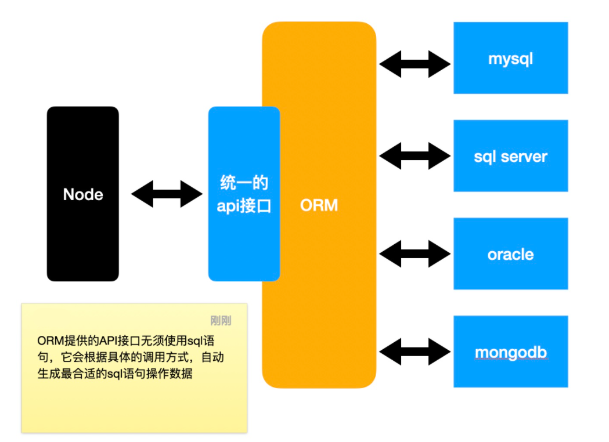

# 数据库

**数据库：持久的数据储存(数据存储在硬盘中)，备份和恢复数据，快速的存取数据，控制权限**

- 数据库（Database）是按照数据结构来组织、存储和管理数据的仓库
- 每个数据库都有一个或多个不同的 API 用于创建，访问，管理，搜索和复制所保存的数据
- 我们也可以将数据存储在文件中，但是在文件中读写数据速度相对较慢
- 所以，现在我们使用关系型数据库管理系统（RDBMS）来存储和管理大数据量。所谓的关系型数据库，是建立在关系模型基础上的数据库，借助于集合代数等数学概念和方法来处理数据库中的数据
- RDBMS 即关系数据库管理系统(Relational Database Management System)的特点：
  - 数据以表格的形式出现
  - 每行为各种记录名称
  - 每列为记录名称所对应的数据域
  - 许多的行和列组成一张表单
  - 若干的表单组成database

## 数据库的类型

-  关系型数据库： 
   - 特点：以表和表的关联构成的数据结构
   - 优点：能表达复杂的数据关系，强大的查询语言能精确查找到想要读写的数据
   - 缺点：读写性能比较差，尤其是海量数据的读写；数据结构比较死板
   - 用途：存储结构复杂的数据
   - 目前主流关系型数据库：Oracle、MySQL、SQL Server
-  非关系型数据库： 
   - 特点：以极其简单的结构存储数据，文档型，键值对存储
   - 优点：格式灵活，海量数据存储读写效率高
   - 缺点：难以表示复杂的数据结构，对于复杂查询效率不好
   - 用途：存储结构简单的数据
   - 目前主流的非关系型数据库：MongoDB、Redis、Membase
-  面向对象数据库 

## 数据库术语

- DB：database    数据库
- DBA：database administrator     数据库管理员
- DBMS：database management system    数据库管理系统
- DBS：database system    数据库系统，DBS包含DB、DBA、DBMS

# MySQL

关系型数据库，原瑞典MySQL AB公司开发，已被Oracle收购，具有开源、轻量、快速的特点

## MySQL使用

-  mysql -uroot -p：输入密码登入连接数据库，进入mysql命令交互 
-  show variables like 'character_set_%'：查看当前数据库字符编码 
-  修改my.ini文件中的默认字符编码：C:\ProgramData\MySQL\MySQL Server 8.0 
-  net stop mysql80    net start mysql80 
-  show databases：查看当前拥有的数据库 
-  可以下载navicat数据库管理和设计工具，更方便 

## MySQL数据库设计

-  Structured Query Language 结构化查询语言，大部分关系型数据，拥有着基本一致的SQL语法 
   - DDL：Data Definition Language 数据定义语言，操作数据库对象：库、表、视图、存储过程
   - DML：Data Manipulation Language 数据操控语言，操作数据库中的记录
   - DCL：Data Control Language 数据控制语句，操作用户权限
-  管理库： 
   - 创建库
   - 创建当前库
   - 删除库
-  管理表： 
   - 创建表：
     字段 ： 
      - 字段名
      - 字段类型： 
        - bit：占1位，0或1，false或true
        - int：占32位，整数
        - decimal(M,N)：能精确计算的实数，M是总的数字位数，N是小数位数
        - char(n)：固定长度位n的字符
        - varchar(n)：长度可变，最大长度位n的字符
        - text：大量的字符
        - date：仅日期
        - datetime：日期和时间
        - time：仅时间
      - 是不是null(是否必填)
      - 自增
      - 默认值
   - 修改表
   - 删除表
-  主键和外键 
   - 主键：根据设计原则，每张表都要有主键，主键必须满足：唯一、不能更改、无业务含义
   - 外键：用于产生表关系的列，外键列会连接到另一张表（或自己）的主键
-  表关系： 
   - 一对一：一个A对应一个B，一个B对应一个A，例如：用户和用户信息，把任意一张表的主键同时设置为外键
   - 一对多：一个A对应多个B，一个B对应一个A，A和B是一对多，B和A是多对一，例如：班级和学生，用户和文章，在多一端的表上设置外键，对应到另一张表的主键
   - 多对多：一个A对应多个B，一个B对应多个A，例如：学生和老师，需要新建一张关系表，关系表至少包含两个外键，分别对应到两张表
-  三大设计范式： 
   - 要求数据库表的每一列都是不可分割的原子数据项
   - 非主键列必须依赖于主键列
   - 非主键列必须直接依赖主键列

## 表记录的增删改查

- DML：Data Manipulation Language 数据操控语言
- CRUD：增 CREATE
- 查 Retrieve
- 改 UPDATE
- 删 DELETE

`INSERT INTO `studentdata`(`name`,age,sex) VALUES('小张',20,DEFAULT),('小王',20,DEFAULT);`
`UPDATE studentdata SET `name`='王小明' WHERE name='小明';`
`DELETE FROM studentdata WHERE `name`='小王';`

### 表单基本查询

-  select 
-  from  

```sql
    SELECT id, loginid, loginpwd, 'abc' as '额外的一列' from `user`;

    SELECT ismale '性别' from `employee`;

    SELECT *, 'abc' as 'extra' from `employee`;

    SELECT id, `name`, 
    case ismale
    when 1 then '男'
    else '女'
    end sex, 
    salary 
    FROM employee;

    SELECT id, `name`, 
    case
    when ismale = 1 then '男'
    else '女'
    end sex, 
    case
    when salary>=10000 then '高'
    when salary>=5000 then '中'
    else '低'
    end `level`,
    salary
    FROM employee;

    SELECT DISTINCT location from employee; --去重

    SELECT location from employee ORDER BY location;

    SELECT DISTINCT location from employee ORDER BY location;
```

-  where：=、in、is、is not、> < >= <=、between、like、and、or  

```sql
    SELECT * FROM employee
    WHERE ismale = 1;

    SELECT * FROM department
    WHERE companyId in (1, 2);

    SELECT * from employee
    WHERE location is not null;

    SELECT * from employee
    WHERE location is null;

    SELECT * from employee
    WHERE salary>=10000;

    SELECT * from employee
    WHERE salary BETWEEN 10000 and 12000;

    SELECT * from employee
    WHERE `name` like '%袁%';

    SELECT * from employee
    WHERE `name` like '袁_';

    SELECT * from employee
    WHERE `name` like '张%' and ismale=0 and salary>=12000;

    SELECT * from employee
    WHERE `name` like '张%' and (ismale=0 and salary>=12000
    or
    birthday>='1996-1-1');
```

-  order by: asc、desc  

```sql
    SELECT *, case ismale
    when 1 then '男'
    else '女'
    end sex from employee
    ORDER BY sex asc, salary desc; --筛选
```

-  limit n,m 跳过n条数据，取出m条数据  

```sql
    SELECT * from employee
    limit 2,3;
```

-  运行顺序：from、where、select、order by、limit 

### 联表查询

- 笛卡尔积：查出两张表的集合

```sql
   SELECT t1.name 主场, t2.name 客场 
   FROM team as t1, team as t2
   WHERE t1.id != t2.id;
```

- 左连接，左外连接，left join

```sql
   SELECT * 
   from department as d left join employee as e
   on d.id = e.deptId;

   SELECT *
   from department as d left join employee as e 
   on d.id = e.deptId
   where salary>=18000;
```

- 右连接，右外连接，right join

```sql
   SELECT *
   from employee as e right join department as d
   on d.id = e.deptId;
```

- 内连接，inner join

```sql
   SELECT *
   from employee as e inner join department as d
   on d.id = e.deptId;

   SELECT e.`name` as empname,d.`name` as dptname,c.`name` as companyname 
   from employee as e
   inner join department as d on d.id = e.deptId
   inner JOIN company as c on d.companyId = c.id;
```

### 函数和分组

-  函数 
   -  内置函数 
      - 数学 
        - ABS(x)         返回x的绝对值
        - CEILING(x)     返回大于x的最小整数值
        - FLOOR(x)       返回小于x的最大整数值
        - MOD(x,y)       返回x/y的模（余数）
        - PI()           返回pi的值（圆周率）
        - RAND()         返回０到１内的随机值
        - ROUND(x,y)     返回参数x的四舍五入的有y位小数的值
        - TRUNCATE(x,y)  返回数字x截短为y位小数的结果

```sql
  SELECT ABS(-1);
  SELECT CEIL(1.4);
  SELECT ROUND(3.1415926, 3);
  SELECT TRUNCATE(3.1415926,3);

  SELECT TRUNCATE(salary,0)
  FROM employee
```

      - 聚合 
         - AVG(col) 返回指定列的平均值
         - COUNT(col) 返回指定列中非NULL值的个数
         - MIN(col) 返回指定列的最小值
         - MAX(col) 返回指定列的最大值
         - SUM(col) 返回指定列的所有值之和

```sql
  SELECT AVG(salary) as `avg`, id
  FROM employee;

  -- 查询员工数量
  SELECT COUNT(id)
  FROM employee;

  SELECT count(id) as 员工数量,
  avg(salary) as 平均薪资,
  sum(salary) as 总薪资,
  min(salary) as 最小薪资
  FROM employee;
```

      - 字符 
         - CONCAT(s1,s2...,sn)   将s1,s2...,sn连接成字符串
         - CONCAT_WS(sep,s1,s2...,sn)  将s1,s2...,sn连接成字符串，并用sep字符间隔
         - TRIM(str)    去除字符串首部和尾部的所有空格
         - LTRIM(str)   从字符串str中切掉开头的空格
         - RTRIM(str)   返回字符串str尾部的空格

```sql
  SELECT CONCAT_WS('@', `name`,salary)
  FROM employee;
```

      - 日期 
         - CURDATE()或CURRENT_DATE()   返回当前的日期
         - CURTIME()或CURRENT_TIME()   返回当前的时间
         - TIMESTAMPDIFF(part,  date1,date2)    返回date1到date2之间相隔的part值，part是用于指定的相隔的年或月或日等 
            - MICROSECOND
            - SECOND
            - MINUTE
            - HOUR
            - DAY
            - WEEK
            - MONTH
            - QUARTER
            - YEAR

```sql
  SELECT CURDATE();

  SELECT CURTIME();

  SELECT TIMESTAMPDIFF(DAY,'2010-1-1 11:11:11','2010-1-2 11:11:12');

  SELECT *, 
  TIMESTAMPDIFF(YEAR, birthday, CURDATE()) as age
  from employee
  ORDER BY age;
```

   -  自定义函数 
-  分组 
   -  运行顺序 
      - from
      - join ... on ...
      - where
      - group by
      - select
      - having
      - order by
      - limit
   -  分组后，只能查询分组的列和聚合列 

### 视图

操作视图属于DDL，主要用于方便查询，不要用来修改数据

# 数据驱动和ORM

## mysql驱动程序

-  什么是驱动程序 
-  驱动程序是连接内存和其他存储介质的桥梁 
-  mysql驱动程序是连接内存数据和mysql数据的桥梁 
-  mysql驱动程序通常使用
   - mysql
   - mysql2	   mysql-native 
   - mysql2的使用 [https://github.com/sidorares/node-mysql2#readme](https://github.com/sidorares/node-mysql2#readme) 

```javascript
   const mysql = require('mysql2/promise');  //异步创建数据库连接
   //创建一个数据库连接
   async function test() {
     const connection = await mysql.createConnection({
       host: 'localhost',
       user: 'root',
       password: '******',
       database: 'databasetest'
     });
     const result = await connection.query("SELECT * FROM `company`;","insert into company(`name`,location,buildDate) values('abbc', '阿萨德', curdate());")
     console.log(result);
     connection.end();
   }
   test();
```

- 防止sql注入，使用execute运行sql语句而不是query，并使用数据连接池：mysql.createPool创建连接，连接池里有限制，一次只能存放一定数量的连接，其他连接等待有位置 
  - sql注入
    用户通过注入sql语句到最终查询中，导致了整个sql与预期行为不符
  - mysql支持变量
    变量的内容不作为任何sql关键字

```javascript
   const mysql = require('mysql2/promise');
   const pool = mysql.createPool({  //创建一个数据库连接池
     host: 'localhost',
     user: 'root',
     password: '******',
     database: 'databasetest'
   });
   async function test(id) {
     const sql =  `select * from employee where \`name\` like concat('%', ?, '%') ;`;
     const [result] = await pool.execute(sql,[id]); 
     console.log(result);
     pool.end();
   }
   test('张');
```

## Sequelize

-  ORM 
   - Object Relational Mapping 对象关系映射
   - 通过ORM框架，可以自动的把程序中的对象和数据库关联
   - ORM框架会隐藏具体的数据库底层细节，让开发者使用同样的数据操作接口，完成对不同数据库的操作，见源码中的「ORM原理图」
   - ORM的优势 
     - 开发者不用关心数据库，仅需关心对象
     - 可轻易的完成数据库的移植
     - 无须拼接复杂的sql语句即可完成精确查询
       
-  Node中的ORM
   -  Sequelize
      JS
      TS
      成熟框架 
   -  TypeORM
      TS
      不成熟 

### 模型定义和同步

Sequelize Docs 中文版：[https://github.com/demopark/sequelize-docs-Zh-CN](https://github.com/demopark/sequelize-docs-Zh-CN)

- 案例：学校数据库
  管理员
  id
  账号
  密码
  姓名
  班级
  id
  名称
  开班时间
  学生
  id
  姓名
  出生日期
  性别
  联系电话
  所属班级
  书籍
  id
  名称
  图片
  出版时间
  作者

```javascript
   const { Sequelize } = require("sequelize");
   const sequelize = new Sequelize("myschooldb", "root", "******", { //连接数据库
       host: "localHost",
       dialect: "mysql",
       logging: null
   });
   module.exports = sequelize;

   //Class举例
   const sequelize = require("./db");
   const { DataTypes } = require("sequelize");  //类型属性
   const Student = require("./Student");
   const Class = sequelize.define(
     "Class",  //表名
     { //定义模型属性
       name: {  
         type: DataTypes.STRING,
         allowNull: false,  //默认为true
       },
       openDate: {
         type: DataTypes.DATE,
         allowNull: false,
       },
     },
     {
       createdAt: false,
       updatedAt: false,
       paranoid: true,
     }
   );
   Class.hasMany(Student); //Class里包含学生
   module.exports = Class;

   // 同步所有模型
   require("./Admin");
   require("./Book");
   require("./Class");
   require("./Student");
   const sequelize = require("./db");
   sequelize.sync({ alter: true }).then(() => {  //模型与数据库同步
   //User.sync() - 如果表不存在,则创建该表(如果已经存在,则不执行任何操作)
   //User.sync({ force: true }) - 将创建表,如果表已经存在,则将其首先删除
   //User.sync({ alter: true }) - 这将检查数据库中表的当前状态(它具有哪些列,它们的数据类型等),然后在表中进行必要的更改以使其与模型匹配.
     console.log("所有模型同步完成");
   });
```

### 模型的增刪改

- 刪除

```javascript
   // 管理员初始化
   // 判断数据库中是否有管理员，如果没有，自动添加一个默认管理员
   const Admin = require("../models/Admin");
   exports.addAdmin = async function (adminObj) {
     // 应该判断adminObj的各种属性是否合理，以及账号是否已存在
     const ins = await Admin.create(adminObj);
     return ins.toJSON();
   };
   exports.deleteAdmin = async function (adminId) {
     // 方式1
     //   // 1.得到实例
     //   const ins = await Admin.findByPk(adminId);
     //   //   console.log(ins);
     //   // 2.删除实例
     //   if (ins) {
     //     await ins.destroy();
     //   }
     // 方式2
     const result = await Admin.destroy({
       where: {
         id: adminId,
       },
     });
     return result;
   };
```

- 改

```javascript
   exports.updateAdmin = async function (id, adminObj) {
     // 方式1
     // // 1. 得到实例
     // const ins = await Admin.findByPk(id);
     // ins.loginId = adminObj.loginId;
     // // 2. 保存
     // ins.save();
     // 方式2
     const result = await Admin.update(adminObj, {
       where: {
         id,
       },
     });
     return result;
   };
```

- 增

```javascript
   exports.addBook = async function (obj) {
     const ins = await Book.create(obj);
     return ins.toJSON();
   };
```

### 模型的查询

```
用的时候查文档：
    Sequelize Docs 中文版：https://github.com/demopark/sequelize-docs-Zh-CN
```

- 查询单个数据：findOne

```javascript
  exports.login = async function (loginId, loginPwd) {
    const result = await Admin.findOne({
      where: {
        loginId,
        loginPwd,
      },
    });
    if (result && result.loginId === loginId && result.loginPwd === loginPwd) {
      return result.toJSON();
    }
    return null;
  };
```

- 按照主键查询单个数据：findByPK

```javascript
  exports.getAdminById = async function (id) {
    const result = await Admin.findByPk(id);
    if (result) {
      return result.toJSON();
    }
    return null;
  };
```

- 查询多个数据：findAll

```javascript
  exports.getAdmins = async function () {
    const result = await Admin.findAll();
    return JSON.parse(JSON.stringify(result));
  };
```

- 查询数量：count

```javascript
  const result = await Student.findAndCountAll({
    attributes: ["id", "name", "sex", "birthdady"],
    where,
    include: [Class],
    offset: (page - 1) * limit,
    limit: +limit,
  });
  return {
    total: result.count,
    datas: JSON.parse(JSON.stringify(result.rows)),
  };
```

- 包含关系：include

```javascript
  const result = await Student.findAndCountAll({
    attributes: ["id", "name", "sex", "birthdady"],
    where,
    include: [Class],
    offset: (page - 1) * limit,
    limit: +limit,
  });
  return {
    total: result.count,
    datas: JSON.parse(JSON.stringify(result.rows)),
  };
```

# 数据模拟 mock

查文档：[http://mockjs.com/](http://mockjs.com/)
举例：

```javascript
   const Mock = require("mockjs");
   const result = Mock.mock({
     "datas|16": [
       {
         "id|+1": 1,
         name: "前端第 @id 期",
         openDate: "@date",
       },
     ],
   }).datas;
   const Class = require("../models/Class");
   Class.bulkCreate(result);

   const Mock = require("mockjs");
   const result = Mock.mock({
     "datas|500-700": [
       {
         name: "@cname",
         birthdady: "@date",
         "sex|1-2": true,
         mobile: /1\d{10}/,
         //   location: "@city(true)",
         "ClassId|1-16": 0,
       },
     ],
   }).datas;
   console.log(result);
   const Student = require("../models/Student");
   Student.bulkCreate(result);
```

# MD5加密

查文档：[https://www.npmjs.com/package/md5](https://www.npmjs.com/package/md5)

- md5加密的特点
  - hash加密算法的一种
  - 可以将任何一个字符串，加密成一个固定长度的字符串
  - 单向加密：只能加密无法解密
  - 同样的源字符串加密后得到的结果固定

# moment

官网：[https://momentjs.com/](https://momentjs.com/)
民间中文网：[http://momentjs.cn/](http://momentjs.cn/)

-  utc和北京时间
   - utc：世界协调时
     - 以英国格林威治时间为标准
     - utc时间和北京时间相差8小时
     - utc的凌晨相当于北京时间的上午8点 
-  时间戳 timestamp
   - 某个utc时间到utc1970-1-1凌晨经过的毫秒数
   - 也可以是秒数，用小数部分记录毫秒
   - 时间戳表示的是utc时间的差异 
-  对于服务器的影响
   - 服务器可能会部署到世界的任何位置
   - 服务器内部应该统一使用utc时间或时间戳，包括数据库 
-  对于客户端的影响
   - 客户端要给不同地区的客户友好的显示时间
   - 客户端应该把时间戳或utc时间转换为本地时间显示

     
     
     

```javascript
  const validate = require("validate.js");
  const moment = require("moment");

  validate.extend(validate.validators.datetime, {
    /**
     * 该函数会自动用于日期格式转换
     * 它会在验证时自动触发，它需要将任何数据转换为时间戳返回
     * 如果无法转换，返回NaN
     * @param {*} value 传入要转换的值
     * @param {*} options 针对某个属性的验证配置
     */
    parse(value, options) {
      let formats = ["YYYY-MM-DD HH:mm:ss", "YYYY-M-D H:m:s", "x"];
      if (options.dateOnly) {
        formats = ["YYYY-MM-DD", "YYYY-M-D", "x"];
      }
      return +moment.utc(value, formats, true);
    },
    /**
     * 用户显示错误消息时，使用的显示字符串
     */
    format(value, options) {
      let format = "YYYY-MM-DD";
      if (!options.dateOnly) {
        format += " HH:mm:ss";
      }
      return moment.utc(value).format(format);
    },
  });
```

# 数据验证

-  数据验证的位置 
   - 前端（客户端）：为了用户体验
   - 路由层：验证接口格式是否正常
   - 业务逻辑层：保证业务完整性
   - 数据库验证（约束）：保证数据完整性
-  相关库---查文档 
   -  validator：[https://github.com/validatorjs/validator.js](https://github.com/validatorjs/validator.js)
      用于验证某个字符串是否满足某个规则 
   -  validate.js(推荐)：[http://validatejs.org/](http://validatejs.org/)
      用于验证某个对象的树形是否满足某些规则 

```javascript
    const rule = {
        //验证规则
        name: {
          presence: {
            allowEmpty: false,
          },
          type: "string",
          length: {
            minimum: 1,
            maximum: 10,
          },
        },
        birthday: {
          presence: {
            allowEmpty: false,
          },
          datetime: {
            dateOnly: true,
            earliest: +moment.utc().subtract(100, "y"),
            latest: +moment.utc().subtract(5, "y"),
          },
        },
        sex: {
          presence: true,
          type: "boolean",
        },
        mobile: {
          presence: {
            allowEmpty: false,
          },
          format: /1\d{10}/,
        },
        ClassId: {
          presence: true,
          numericality: {
            onlyInteger: true,
            strict: false,
          },
          classExits: true,
        },
      };
      await validate.async(stuObj, rule);
      const ins = await Student.create(stuObj);
      return ins.toJSON();
    };
```

## 访问器和虚拟字段

```javascript
  const sequelize = require("./db");
  const { DataTypes } = require("sequelize");
  const moment = require("moment");
  module.exports = sequelize.define(
    "Student",
    {
      name: {
        type: DataTypes.STRING,
        allowNull: false,
      },
      birthday: {
        type: DataTypes.DATE,
        allowNull: false,
        get() { //访问器，拿到并修改内容
          return this.getDataValue("birthday").getTime();
        },
      },
      age: { //虚拟字段，计算得到，但初始化数据库的时候要把这一栏加上
        type: DataTypes.VIRTUAL,
        get() {
          const now = moment.utc();
          const birth = moment.utc(this.birthday);
          return now.diff(birth, "y"); //得到两个日期的年份的差异
        },
      },
      sex: {
        type: DataTypes.BOOLEAN,
        allowNull: false,
      },
      mobile: {
        type: DataTypes.STRING(11),
        allowNull: false,
      },
    },
    {
      createdAt: false,
      updatedAt: false,
      paranoid: true,
    }
  );
```

# 日志记录

常用库：log4js：[https://log4js-node.github.io/log4js-node/](https://log4js-node.github.io/log4js-node/)     查文档

- level：日志级别
  - 例如调试日志、信息日志、错误日志等等
  - 见源码中的示意图
- category：日志分类
  - 例如：sql日志、请求日志等等
- appender：日志出口
  - 应该把日志写到哪？
  - 日志的书写格式是什么（layouts）

```javascript
 const log4js = require("log4js");
 const path = require("path");
 log4js.configure({
   appenders: {
     sql: {
       //定义一个sql日志出口
       type: "dateFile",
       filename: path.resolve(__dirname, "logs", "sql", "logging.log"),
       maxLogSize: 1024 * 1024, //配置文件的最大字节数
       keepFileExt: true,
       layout: {
         type: "pattern",
         pattern: "%c [%d{yyyy-MM-dd hh:mm:ss}] [%p]: %m%n",
       },
     },
     default: {
       type: "stdout",
     },
   },
   categories: {
     sql: {
       appenders: ["sql"], //该分类使用出口sql的配置写入日志
       level: "all",
     },
     default: {
       appenders: ["default"],
       level: "all",
     },
   },
 });

 process.on("exit", () => {
   log4js.shutdown();
 });

 const sqlLogger = log4js.getLogger("sql");
 const defaultLogger = log4js.getLogger();

 exports.sqlLogger = sqlLogger;
 exports.logger = defaultLogger;


 const { Sequelize } = require("sequelize");
 const { sqlLogger } = require("../logger");
 const sequelize = new Sequelize("myschooldb", "root", "ybybdwyJ42.", {
   host: "localhost",
   dialect: "mysql",
   logging: (msg) => {
     sqlLogger.debug(msg);
   },
 });
 
 module.exports = sequelize;
```