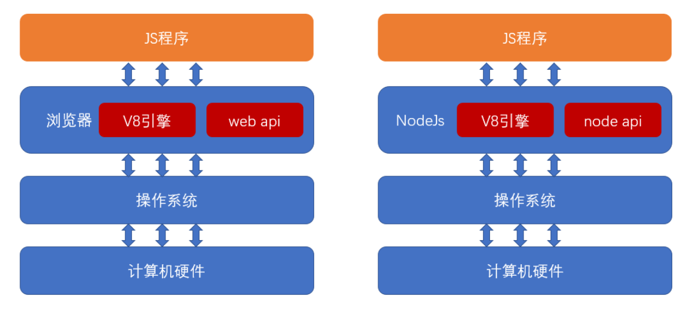
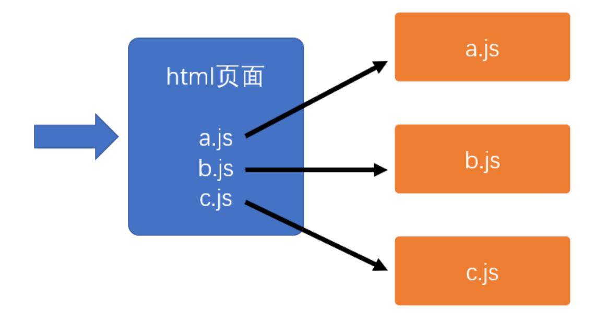
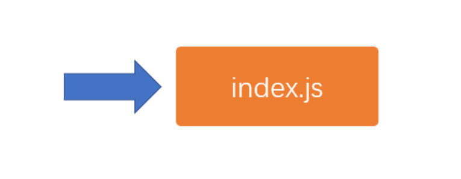
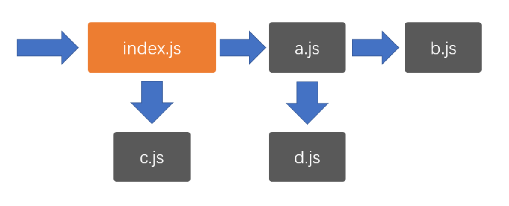
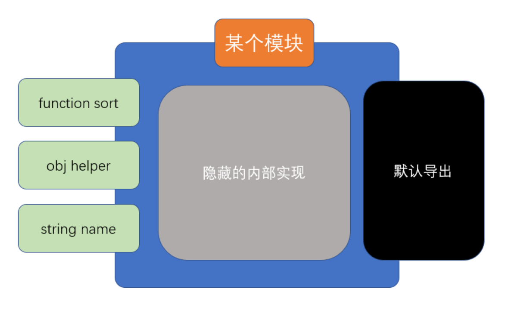
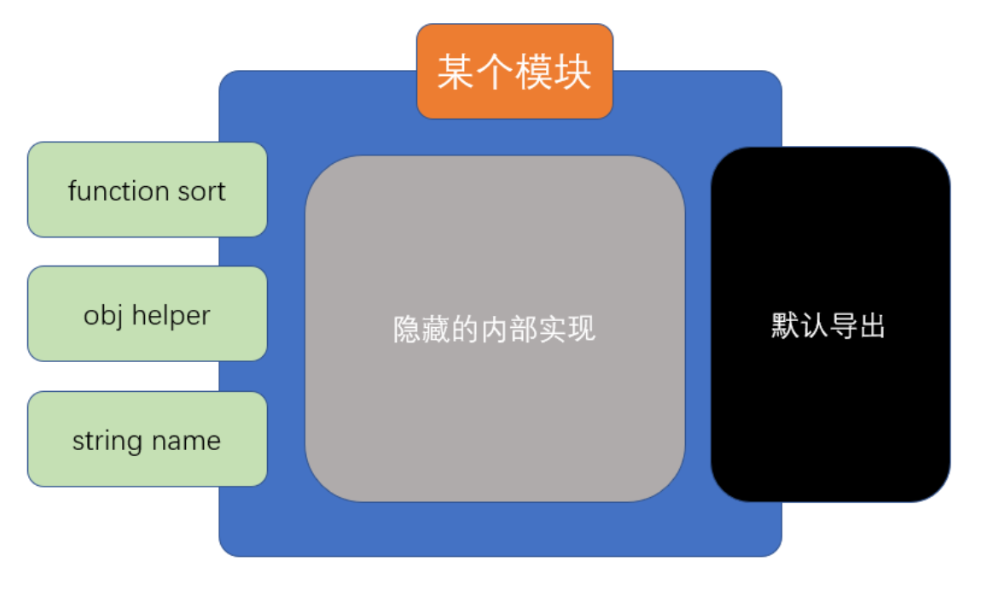
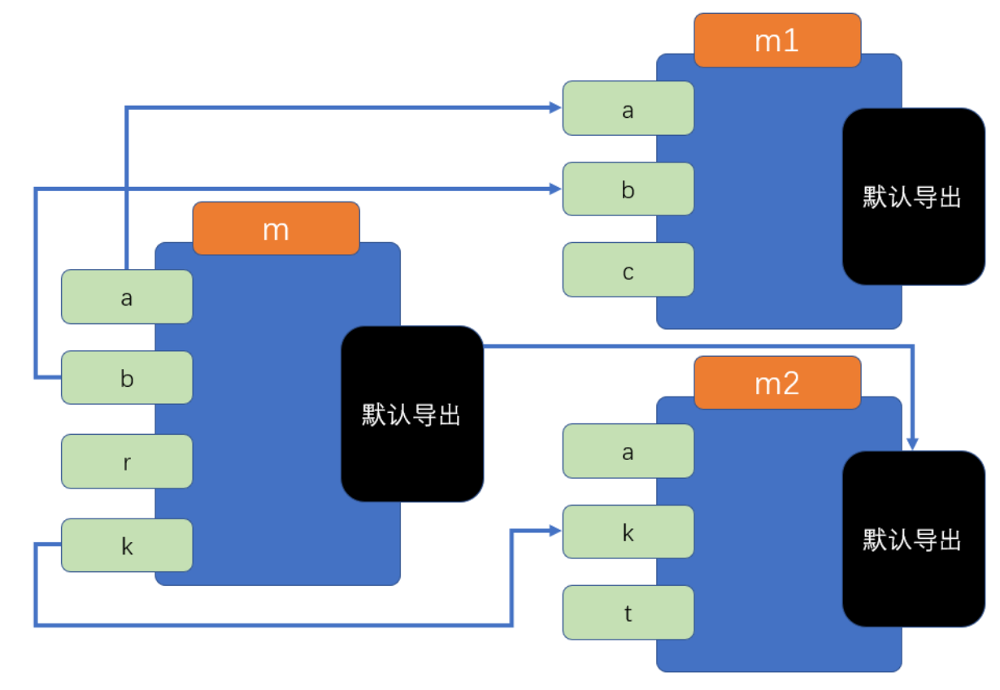

# 模块化
## JavaScript 模块化发展史
### 第一阶段

- 在 JavaScript 语言刚刚诞生的时候，它仅仅用于实现页面中的一些小效果
- 那个时候，一个页面所用到的 JS 可能只有区区几百行的代码
- 在这种情况下，语言本身所存在的一些缺陷往往被大家有意的忽略，因为程序的规模实在太小，只要开发人员小心谨慎，往往不会造成什么问题
- 在这个阶段，也不存在专业的前端工程师，由于前端要做的事情实在太少，因此这一部分工作往往由后端工程师顺带完成
- 第一阶段发生的大事件：
   - 1996年，NetScape将JavaScript语言提交给欧洲的一个标准制定组织ECMA（欧洲计算机制造商协会）
   - 1998年，NetScape在与微软浏览器IE的竞争中失利，宣布破产
### 第二阶段

- 1998年，ajax的出现，逐渐改变了 JavaScript 在浏览器中扮演的角色。现在，它不仅可以实现小的效果，还可以和服务器之间进行交互，以更好的体验来改变数据
- JS代码的数量开始逐渐增长，从最初的几百行，到后来的几万行，前端程序逐渐变得复杂
- 后端开发者压力逐渐增加，致使一些公司开始招募专业的前端开发者
- 但此时，前端开发者的待遇远不及后端开发者，因为前端开发者承担的开发任务相对于后端开发来说，还是比较简单的，通过短短一个月的时间集训，就可以成为满足前端开发的需要
- 究其根本原因，是因为前端开发还有几个大的问题没有解决，这些问题都严重的制约了前端程序的规模进一步扩大：
1. **浏览器解释执行JS的速度太慢**
2. **用户端的电脑配置不足**
3. **更多的代码带来了全局变量污染、依赖关系混乱等问题**
- 上面三个问题，就像是阿喀琉斯之踵，成为前端开发挥之不去的阴影和原罪。
- 在这个阶段，前端开发处在一个非常尴尬的境地，它在传统的开发模式和前后端分离之间无助的徘徊
- 第二阶段的大事件：
   - IE浏览器制霸市场后，几乎不再更新
   - ES4.0流产，导致JS语言10年间几乎毫无变化
   - 2008年ES5发布，仅解决了一些 JS API 不足的糟糕局面
### 第三阶段

- 时间继续向前推移，到了2008年，谷歌的 V8 引擎发布，将JS的执行速度推上了一个新的台阶，甚至可以和后端语言媲美
- 摩尔定律持续发酵，个人电脑的配置开始飞跃
- 突然间，制约前端发展的两大问题得以解决，此时，只剩下最后一个问题还在负隅顽抗，即**全局变量污染和依赖混乱**的问题，解决了它，前端便可以突破一切障碍，未来无可限量
- 于是，全世界的前端开发者在社区中激烈的讨论，想要为这个问题寻求解决之道......
- 2008年，有一个名叫 Ryan Dahl 小伙子正在为一件事焦头烂额，它需要在服务器端手写一个高性能的web服务，该服务对于性能要求之高，以至于目前市面上已有的web服务产品都满足不了需求
- 经过分析，它确定，如果要实现高性能，那么必须要尽可能的减少线程，而要减少线程，避免不了要使用异步的处理方案
- 一开始，他打算自己实用C/C++语言来编写，可是这一过程实在太痛苦
- 就在他一筹莫展的时候，谷歌 V8 引擎的发布引起了他的注意，他突然发现，JS不就是最好的实现web服务的语言吗？它天生就是单线程，并且是基于异步的！有了V8引擎的支撑，它的执行速度完全可以撑起一个服务器。而且V8是鼎鼎大名的谷歌公司发布的，谷歌一定会不断的优化V8，有这种又省钱又省力的好事，我干嘛还要自己去写呢？
- 于是，它基于开源的V8引擎，对源代码作了一些修改，便快速的完成了该项目
- 2009年，Ryan推出了该web服务项目，命名为nodejs
- 从此，JS第一次堂堂正正的入主后端，不再是必须附属于浏览器的“玩具”语言了
- 也是从此刻开始，人们认识到，JS（ES）是一门真正的语言，它依附于运行环境（运行时）（宿主程序）而执行




- nodejs的诞生，便把JS中的最后一个问题放到了台前，即**全局变量污染和依赖混乱**问题
- 要直到，nodejs是服务器端，如果不解决这个问题，分模块开发就无从实现，而模块化开发是所有后端程序必不可少的内容
- 经过社区的激烈讨论，最终，形成了一个模块化方案，即鼎鼎大名的CommonJS，该方案，彻底解决了全局变量污染和依赖混乱的问题
- 该方案一出，立即被nodejs支持，于是，nodejs成为了第一个为JS语言实现模块化的平台，为前端接下来的迅猛发展奠定了实践基础
- 该阶段发生的大事件：
   - 2008年，V8发布
   - IE的市场逐步被 firefox 和 chrome 蚕食，现已无力回天
   - 2009年，nodejs发布，并附带commonjs模块化标准
### 第四阶段

- CommonJS的出现打开了前端开发者的思路
- 既然后端可以使用模块化的JS，作为JS语言的老东家浏览器为什么不行呢？
- 于是，开始有人想办法把CommonJS运用到浏览器中
- 可是这里面存在诸多的困难（课程中详解）
- 办法总比困难多，有些开发者就想，既然CommonJS运用到浏览器困难，我们干嘛不自己重新定一个模块化的标准出来，难道就一定要用CommonJS标准吗？
- 于是很快，AMD规范出炉，它解决的问题和CommonJS一样，但是可以更好的适应浏览器环境
- 相继的，CMD规范出炉，它对AMD规范进行了改进
- 这些行为，都受到了ECMA官方的密切关注......
- 2015年，ES6发布，它提出了官方的模块化解决方案 —— ES6 模块化
- 从此以后，模块化成为了JS本身特有的性质，这门语言终于有了和其他语言较量的资本，成为了可以编写大型应用的正式语言
- 于此同时，很多开发者、技术厂商早已预见到JS的无穷潜力，于是有了下面的故事
   - 既然JS也能编写大型应用，那么自然也需要像其他语言那样有解决复杂问题的开发框架 
      - Angular、React、Vue等前端开发框架出现
      - Express、Koa等后端开发框架出现
      - 各种后端数据库驱动出现
   - 要开发大型应用，自然少不了各种实用的第三方库的支持 
      - npm包管理器出现，实用第三方库变得极其方便
      - webpack等构建工具出现，专门用于打包和部署
   - 既然JS可以放到服务器环境，为什么不能放到其他终端环境呢？ 
      - Electron发布，可以使用JS语言开发桌面应用程序
      - RN和Vuex等技术发布，可以使用JS语言编写移动端应用程序
      - 各种小程序出现，可以使用JS编写依附于其他应用的小程序
      - 目前还有很多厂商致力于将JS应用到各种其他的终端设备，最终形成大前端生态
> 可以看到，模块化的出现，是JS通向大型应用的基石，学习好模块化，便具备了编写大型应用的基本功。

## 安装nodejs
官网地址：[https://nodejs.org/zh-cn/](https://nodejs.org/zh-cn/)
## 使用 nvm 管理node版本
Github：[https://github.com/nvm-sh/nvm](https://github.com/nvm-sh/nvm)
### 常用命令
```shell
# 安装最新稳定版本 
nvm install stable
# 列出所有可安装的版本
nvm ls-remote
# 安装指定版本 
nvm install <version>
# 列出所有已经安装的版本
nvm ls
# 切换使用指定的版本
nvm use <version>
# 显示当前使用的版本
nvm current
# 设置默认 `node` 版本
nvm alias default <version>
# 解除当前版本绑定
nvm deactivate
# 删除某版本的node
nvm uninstall <version>
```
### windows 系统的安装方法
建议去[ GitHub ](https://github.com/coreybutler/nvm-windows)下载手动安装
### Mac(M1) 系统的安装方法

- 如果已经安装node，先删除
```shell
# 查看已经安装在全局的模块
npm ls -g --depth=0
# 删除全局 node_modules 目录
sudo rm -rf /usr/local/lib/node_modules
# 删除 node
sudo rm /usr/local/bin/node 
# 删除全局 node 模块注册的软链
cd /usr/local/bin && ls -l | grep "../lib/node_modules/" | awk '{print $9}'| xargs rm
```

1. 执行安装指令
```shell
curl -o- https://raw.githubusercontent.com/nvm-sh/nvm/v{版本号}/install.sh | bash
```

2. 打开终端，进入用户的home目录中
```shell
cd ~/
```

3. 检查配置文件

使用 ls -a 显示这个目录下的所有文件（夹）（包含隐藏文件及文件夹），查看有没有 .zshrc 这个文件
```shell
ls -a
```

4. 如果没有，则新建一个
```shell
touch ~/.zshrc
```

5. 配置.zshrc文件

将 nvm 环境变量添加到 shell 中，打开.zshrc文件，在最后一行添加
```shell
export NVM_DIR="$HOME/.nvm"
[ -s "$NVM_DIR/nvm.sh" ] && \. "$NVM_DIR/nvm.sh"  # This loads nvm
[ -s "$NVM_DIR/bash_completion" ] && \. "$NVM_DIR/bash_completion"  # This loads nvm bash_completion
```

6. 加载配置文件
```shell
source ~/.zshrc
```
**如果要安装14以下的node版本，先进入Rosetta shell环境，再下载**
```shell
arch -x86_64 zsh
```
### node的安装位置

- 在终端我们可以使用 which node 来查看我们的 node 被安装到了哪里，这里终端打印出来的地址其实是你当前使用的 node 版本快捷方式的地址
- 如果你想查看所有 node 版本的安装文件夹，我们可以在 访达（finder） 中使用快捷键 Command+Shift+G 输入 /Users/你的用户名/.nvm/versions 地址就可以看到
-  Mac 默认是不显示隐藏文件夹的，.nvm 是个隐藏文件夹在 访达（finder） 中看不到，在 Mac 下显示隐藏文件的快捷键是 Command+Shift+.，关闭也是这个快捷键
### linux 系统的安装方法
下载
```shell
 curl -o- https://raw.githubusercontent.com/creationix/nvm/v{版本号}/install.sh | bash 
 # or
 wget -qO- https://raw.githubusercontent.com/creationix/nvm/v{版本号}/install.sh | bash 
```
然后
```shell
 source ~/.bashrc 
```
## 浏览器中的模块

- 浏览器运行的是html页面，并加载页面中通过script元素引入的js



## nodejs中的模块

- nodejs直接运行某个js文件，该文件被称之为入口文件



- nodejs遵循EcmaScript标准，但由于脱离了浏览器环境，因此：
   - 你可以在nodejs中使用EcmaScript标准的任何语法或api，例如：循环、判断、数组、对象等
   - 你不能在nodejs中使用浏览器的 web api，例如：dom对象、window对象、document对象等
- 由于大部分开发者是从浏览器端开发转向nodejs开发的，为了降低开发者的学习成本，nodejs中提供了一些和浏览器web api同样的对象或函数，例如：console、setTimeout、setInterval等
## CommonJS

- 在nodejs中，由于有且仅有一个入口文件（启动文件），而开发一个应用肯定会涉及到多个文件配合，因此，nodejs对模块化的需求比浏览器端要大的多



- 由于nodejs刚刚发布的时候，前端没有统一的、官方的模块化规范，因此，它选择使用社区提供的CommonJS作为模块化规范
- 在学习CommonJS之前，首先认识两个重要的概念：**模块的导出**和**模块的导入**
### 模块的导出

- 要理解模块的导出，首先要理解模块的含义
- 什么是模块？
   - 模块就是一个JS文件，它实现了一部分功能，并隐藏自己的内部实现，同时提供了一些接口供其他模块使用
   - 模块有两个核心要素：**隐藏**和**暴露**
      - 隐藏的，是自己内部的实现
      - 暴露的，是希望外部使用的接口
- 任何一个正常的模块化标准，都应该默认隐藏模块中的所有实现，而通过一些语法或api调用来暴露接口
- **暴露接口的过程即模块的导出**
```js
exports.a = 1;

module.exports = {
    a: 3
}
```


### 模块的导入

- 当需要使用一个模块时，使用的是该模块暴露的部分（导出的部分），隐藏的部分是永远无法使用的
- **当通过某种语法或api去使用一个模块时，这个过程叫做模块的导入**
```js
require("a")
```
### CommonJS导入导出规范

- CommonJS使用`exports`导出模块，`require`导入模块
- 具体规范如下：
   - 如果一个JS文件中存在`exports`或`require`，该JS文件是一个模块
   - 模块内的所有代码均为隐藏代码，包括全局变量、全局函数，这些全局的内容均不应该对全局变量造成任何污染
   - 如果一个模块需要暴露一些API提供给外部使用，需要通过`exports`导出，`exports`是一个空的对象，你可以为该对象添加任何需要导出的内容
   - 如果一个模块需要导入其他模块，通过`require()`实现，`require()`是一个函数，传入模块的路径即可返回该模块导出的整个内容
   - node.js中导入模块，使用相对路径，并且必须以./或../开头
### nodejs对CommonJS的实现

- 为了实现CommonJS规范，nodejs对模块做出了以下处理
   -  为了保证高效的执行，仅加载必要的模块。nodejs只有执行到`require`函数时才会加载并执行模块 
   -  为了隐藏模块中的代码，nodejs执行模块时，会将模块中的所有代码放置到一个函数中执行，以保证不污染全局变量。  
```javascript
 (function(){
     //模块中的代码
 })()
```

-  为了保证顺利的导出模块内容，nodejs做了以下处理 
   - 在模块开始执行前，初始化一个值`module.exports = {}`
   - `module.exports`即模块的最终导出值，而不是导出exports
   - 为了方便开发者便捷的导出，nodejs在初始化完`module.exports`后，又声明了一个变量`exports = module.exports`
```javascript
 (function(module){
     module.exports = {};
     var exports = module.exports;
     //模块中的代码
     return module.exports;
 })()
```

-  为了避免反复加载同一个模块，nodejs默认开启了模块缓存，如果加载的模块已经被加载过了，则会自动使用之前的导出结果
### CommonJS的工作原理

- 当使用`require(模块路径)`导入一个模块时，node会做以下两件事情（不考虑模块缓存）：
   - 通过模块路径找到本机文件，并读取文件内容
   - 将文件中的代码放入到一个函数环境中执行，并将执行后module.exports的值作为require函数的返回结果
- 正是这两个步骤，使得CommonJS在node端可以良好的被支持
- 可以认为，**CommonJS是同步的**，必须要等到加载完文件并执行完代码后才能继续向后执行
## 浏览器端CommonJS模块化的难题与实现
### 当浏览器遇到CommonJS

- 当想要把CommonJS放到浏览器端时，就遇到了一些挑战
   - 浏览器要加载JS文件，需要远程从服务器读取，而网络传输的效率远远低于node环境中读取本地文件的效率。由于CommonJS是同步的，这会极大的降低运行性能
   - 如果需要读取JS文件内容并把它放入到一个环境中执行，需要浏览器厂商的支持，可是浏览器厂商不愿意提供支持，最大的原因是CommonJS属于社区标准，并非官方标准
- 基于以上两点原因，浏览器无法支持模块化
- 可这并不代表模块化不能在浏览器中实现
- 要在浏览器中实现模块化，只要能解决上面的两个问题就行了
- 解决办法其实很简单：
   - 远程加载JS浪费了时间？做成异步即可，加载完成后调用一个回调就行了
   - 模块中的代码需要放置到函数中执行？编写模块时，直接放函数中就行了
- 基于这种简单有效的思路，出现了AMD和CMD规范，有效的解决了浏览器模块化的问题
### AMD

- 全称是Asynchronous Module Definition，即异步模块加载机制
- require.js实现了AMD规范
- 在AMD中，导入和导出模块的代码，都必须放置在define函数中
```javascript
define([依赖的模块列表], function(模块名称列表){
    //模块内部的代码
    return 导出的内容
})
```
### CMD
全称是Common Module Definition，公共模块定义规范
sea.js实现了CMD规范
在CMD中，导入和导出模块的代码，都必须放置在define函数中
```javascript
define(function(require, exports, module){
    //模块内部的代码
})
```
## ES6模块化

- ECMA组织参考了众多社区模块化标准，终于在2015年，随着ES6发布了官方的模块化标准，后成为ES6模块化
- ES6模块化具有以下的特点
   - 使用依赖**预声明**的方式导入模块 
      - 依赖延迟声明 
         - 优点：某些时候可以提高效率
         - 缺点：无法在一开始确定模块依赖关系（比较模糊）
      - 依赖预声明 
         - 优点：在一开始可以确定模块依赖关系
         - 缺点：某些时候效率较低
   - 灵活的多种导入导出方式
   - 规范的路径表示法：所有路径必须以./或../开头
### 基本导入导出
#### 模块的引入

- **注意：这一部分非模块化标准**
- 目前，浏览器使用以下方式引入一个ES6模块文件
```html
<script src="入口文件" type="module">
```
#### 模块的基本导出和导入
ES6中的模块导入导出分为两种：

1. 基本导入导出
2. 默认导入导出

##### 基本导出

- 类似于 `exports.xxx = xxxx`
- 基本导出可以有多个，每个必须有名称
- 基本导出的语法如下：
```javascript
export 声明表达式
export let a = 1; 导出a，值为1
export function test(){}导出test，值为一个函数
//也可以导出类数组对象等等。必须是声明
```
或
```javascript
export {具名符号}
let age = 18;
let sex = 1;
export { age, sex }//将age的名称作为导出名称，age和sex变量的值作为导出值，这里并不是导出对象
```

- 由于基本导出必须具有名称，所以要求导出内容必须跟上**声明表达式**或**具名符号**
##### 基本导入

- 由于使用的是**依赖预加载**，因此，导入任何其他模块，导入代码必须放置到所有代码之前
- 对于基本导出，如果要进行导入，使用下面的代码
```javascript
import {导入的符号列表} from "模块路径" ;
import { age, sex } from './a.js';//要什么导入什么即可。如可以只导入age
```
**注意以下细节：**

- 导入时，可以通过关键字`as`对导入的符号进行重命名： 
```javascript
import { age as age2, sex as sex2 } form './a.js';
```

- 导入时使用的符号是常量，不可修改，不可重新赋值
- 可以使用*号导入所有的基本导出，形成一个对象： 
```javascript
import * from './a.js';
```

- **不使用任何导出，只运行文件： **
```javascript
import './a.js';
```
#### 默认导入导出

##### 默认导出

- 每个模块，除了允许有多个基本导出之外，还允许有一个默认导出
- 默认导出类似于CommonJS中的`module.exports`，由于只有一个，因此无需具名
- 具体的语法是
```javascript
export default 默认导出的数据
```
或
```javascript
export {默认导出的数据 as default}
```

- 由于每个模块仅允许有一个默认导出，因此，每个模块不能出现多个默认导出语句
##### 默认导入

- 需要想要导入一个模块的默认导出，需要使用下面的语法
```javascript
import 接收变量名 from "模块路径"
import data from './b.js';
```

   - 类似于CommonJS中的`var 接收变量名 = require("模块路径")`
- 由于默认导入时变量名是自行定义的，因此没有别名一说
- 如果希望同时导入某个模块的默认导出和基本导出，可以使用下面的语法
```javascript
import 接收默认导出的变量, {接收基本导出的变量} from "模块路径";
import data, {e, r} from './b.js';
import * as data from './b.js';//基本导出和默认导出聚合到data对象中
```

- **注：如果使用*号，会将所有基本导出和默认导出聚合到一个对象中，默认导出会作为属性default存在**
### ES6模块化的其他细节

- **尽量导出不可变值**
   - 当导出一个内容时，尽量保证该内容是不可变的（大部分情况都是如此）
   - 因为，虽然导入后，无法更改导入内容，但是在导入的模块内部却有可能发生更改，这将导致一些无法预料的事情发生
- **可以使用无绑定的导入用于执行一些初始化代码**
   - 如果我们只是想执行模块中的一些代码，而不需要导入它的任何内容，可以使用无绑定的导入：
```javascript
import "模块路径"
```

- **可以使用绑定再导出，来重新导出来自另一个模块的内容**
   - 有的时候，我们可能需要用一个模块封装多个模块，然后有选择的将多个模块的内容分别导出，可以使用下面的语法轻松完成
```javascript
export {绑定的标识符(模块名)} from "模块路径"
```

